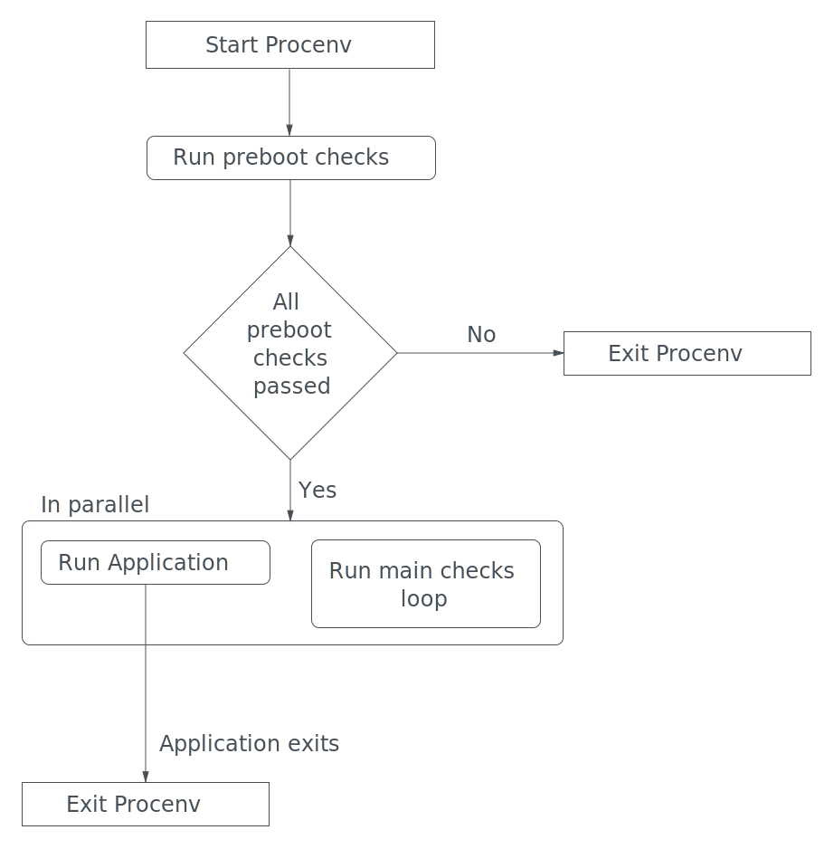

# Procenv: Lifecycle

Procenv maintains a lifecycle, in order to keep up with the status of the Application, inform the user and handle situations gracefully. This lifecycle can be described in 5 steps:

1. Procenv start
2. Run all preboot checks
3. If not all preboot checks succeed, then exit Procenv
4. If all preboot checks succeed, then run the Application and the main checks loop in parallel
5. When the Application exits, then exit Procenv

## Control Flow Diagram

If you are more of a visual person, you can see a control flow diagram approach to the Procenv lifecycle.

